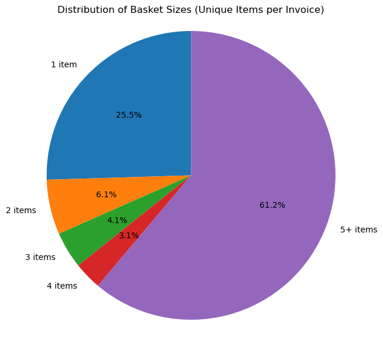

# e-commerce_recommender_model
Data Science Institute Team ML6 repo
Members:
- Kunal Dekhane
- Rahul Nanda
- Venkusa Dhondaley
- Diogo Brian Barco
- Volodomyr Shchesnovych

# Dataset: Online Retail II
This is a classic retail transaction dataset (it’s actually from the UCI Online Retail Dataset, often used in ML and analytics) - https://archive.ics.uci.edu/dataset/502/online+retail+ii
The Online_Retail_II.xlsx dataset contains detailed records of retail transactions spanning the 2009–2010 and 2010–2011 periods. The key variables utilized for modeling include Invoice, StockCode, Description, and InvoiceDate, which collectively capture the transaction identity, product details, and timing of each purchase. The Online_Retail_II dataset consists of 1,033,036 transaction records across 8 key columns, capturing retail activity between 2009–2011.

Key Features:

Invoice: Unique identifier for each transaction

StockCode: Product code for each item sold

Description: Name/description of the product

Quantity: Number of units purchased per transaction line

InvoiceDate: Date and time of the transaction

Price: Unit price of the product

Customer ID: Unique identifier for each customer

Country: Country of the customer

# Project Plan

## Business context
32% of the orders have only 1 or 2 items, and 80% of the serious website visitors (visited at least 2 pages and with viewing time of over 15 seconds) do not place an order or add item to cart - which is a lost opportunity.

## Opportunity
By analyzing customer behavior and purchase patterns, we can deliver personalized product suggestions that encourage additional purchases, increase the average order value, and enhance the overall shopping experience, ultimately driving sustainable revenue growth through effective cross-selling and customer engagement strategies.

## Analysis
We will use features from the cleaned / processed dataset to identify customers interests based on their online purchase history. We will then model similarity indexes across customer purchases. This will help create a tool (running in background) that the online retail website can use to generate a list of similar (related) products that will display on the webpage so that customers can click-on to add to their online shopping basket.
- Opportunity: By analyzing customer behavior and purchase patterns, we can deliver personalized product suggestions that encourage additional purchases, increase the average order value, and enhance the overall shopping experience, ultimately driving sustainable revenue growth through effective cross-selling and customer engagement strategies.

- Analysis: The dataset represents global retail transactions, with the majority of records originating from the United Kingdom. Our analysis focuses on the B2C segment, aiming to recommend complementary products that are frequently purchased together with items in a customer’s cart. This strategy is designed to enhance cross-selling opportunities and drive overall revenue growth.

  The dataset contains approximately 1,033,036 transaction records. During the review, several data quality issues were identified that require cleaning and preprocessing:

  Missing Customer IDs: Some transactions lack Customer ID information, making it difficult to link purchases to specific customers.

  Negative Quantities: Certain records include negative quantities, which typically represent order cancellations or returns.

  Cancelled Invoices: Invoices with negative quantities or missing Customer IDs are considered invalid or cancelled and will be excluded from the analysis.

  Suspicious or Incomplete Records: Additional checks will be performed to identify zero or negative prices and other inconsistencies.

  Duplicate Records: Several transactions appear to be duplicated (same Invoice, StockCode, Quantity, and InvoiceDate). These will be identified and removed to avoid inflating sales metrics and skewing the analysis.
  
  A structured data cleaning plan will be implemented to address these issues before modeling, ensuring that only valid and reliable transactions are used for analysis.

  Outliers were detected in the dataset, including invoices with extremely large basket sizes, unusually high quantities, or suspicious transaction patterns. These abnormal orders can heavily skew metrics like average basket size, revenue, and product co-occurrence, so they require additional review and potential filtering.

  We will use features from the cleaned / processed dataset to identify customers interests based on their online purchase history. We will then model similarity indexes across customer purchases. This will help create a tool (running in background) that the online retail website can use to generate a list of similar (related) products that will display on the webpage so that customers can click-on to add to their online shopping basket.

  The analysis of retail transaction data reveals that smaller baskets form a minority of overall purchases. Approximately 25% of transactions contain only a single item, while 6% include two items, 4% include three items, and another 3% include four items. The majority of transactions — about 61% — consist of five or more items per purchase.

  This distribution highlights that while most customers tend to buy multiple products per transaction, there remains a significant opportunity to engage single- or low-item purchasers through personalized product recommendations and cross-selling strategies, encouraging them to expand their baskets and increasing the overall average order value.

## Solution
We will build a hybrid recommendation engine to deliver personalized product recommendations combining:

        a. Apriori association rules
        b. collaborative and content-based filtering
        c. RFM (Recency, Frequency, Monetary) analysis

- Results & Recommendations: Our goal is to develop a recommender model which results in:

        a. Reducing the low-basket orders from 32% to 10%
        b. Improving conversion among serious visitors from 8% to 10% resulting in 25% increase in monthly order volume (177 additional orders)

## Risks & Limitations
The relatively large size of the dataset could be a potential cause for concern. The source file that was downloaded from the UCI ML repository is a large (45 MB) Microsoft Excel .xlsx file with two separate worksheets covering transactions over two consecutive years. Each of these worksheets contains approximately 500,000 entries (rows). The data cleaning & pre-processing stage therefore yielded a dataframe with over 1 million entries (rows). As a point of reference, the largest dataset size in prior modules was around 10,000 entries (rows). So our project dataset represents a 100x increase.

The main risk or unknown at this point is the size of the data and how this could negatively impact runtimes for model fitting (training) and experimentation, when running on a "seasoned" platform (read older CPUs). Were this to present an issue, a viable mitigation strategy might be to migrate the project to an online machine learning environment e.g. [Google Colab](https://colab.research.google.com/).

A limitation of the dataset is the inherent regional bias: most of the transactions are in western European countries, with the vast majority being from the United Kingdom, while Canadian (indeed North American) transactions comprise less than 1 % of the dataset. Note that this is not necessarily an issue, as preferences of UK shoppers is arguably similar to those of their American and Canadian counterparts for a large range of products and the model could therefore readily be applied to North American markets as well.
